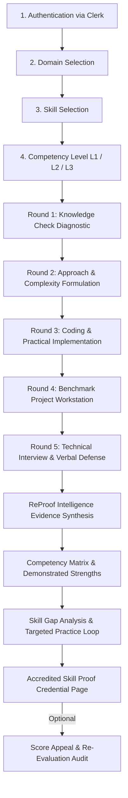

# ReProof — Verifiable Competency Verification Platform

> **"Show Us What You Can Do."**  
> An evidence-based, accredited technical skill assessment system that bridges the gap between claims and reproducible proof.

---

## 1. Problem Statement
Traditional technical credentialing is fundamentally broken:
- **Multiple-choice quizzes** test surface memorization rather than applied engineering competence.
- **Resume claims** are unverified, leading to inflated credentials and prolonged interview cycles.
- **Naive coding tests** (like LeetCode grinding) fail to measure end-to-end architectural reasoning, edge case handling, or verbal defense of design decisions.
- **Cheating & AI generation** concerns have eroded trust in unproctored online assessments.

---

## 2. The Solution: ReProof
ReProof transforms technical assessment from subjective grading into an **objective, multi-round evidence dossier**:
1. **Multi-Source Evidence Pipeline:** Gathers observable data across knowledge, architectural planning, practical coding, repository projects, and live verbal interviews.
2. **Deterministic Server-Side Scoring:** Official evaluations are calculated deterministically via weighted criteria—preventing AI models from inventing arbitrary scores or hallucinating competencies.
3. **Predefined 45-Profile Rubric Bank:** Calibrated competency expectations across 5 engineering domains, 15 discrete skills, and 3 depth levels.
4. **Actionable Skill Gap & Practice Loop:** Identifies exact deltas between *expected* level benchmarks and *observed* candidate behaviors, feeding directly into targeted practice drills.
5. **Cryptographically Anchored Skill Proof:** Delivers an accredited verification credential backed by an immutable SHA-256 ledger hash.
6. **Built-in Score Appeal Mechanism:** Preserves original evaluation ledgers while offering candidate re-evaluation under identical rubric benchmarks.

---

## 3. How ReProof Works
Instead of averaging random scores into a single superficial percentage, ReProof maps candidate artifacts against a **5-Round Competency Matrix**:
- Each criterion is verified across **Knowledge**, **Approach**, **Coding**, **Project**, and **Interview** rounds.
- Each round produces verified statuses: `Demonstrated` ($\ge 70\%$), `Developing` ($50\%-69\%$), or `Insufficient Evidence` ($< 50\%$).
- The official competency composite is computed by the backend formula:
  $$\text{Official Score} = 0.15 \times \text{Knowledge} + 0.15 \times \text{Approach} + 0.25 \times \text{Coding} + 0.30 \times \text{Project} + 0.15 \times \text{Interview}$$

---

## 4. Complete Assessment Flow



---

## 5. Domains and Skills Taxonomy (15 Skills $\times$ 3 Levels = 45 Configurations)

| Domain | Skills | Level 1 (Foundation) | Level 2 (Applied) | Level 3 (Advanced) |
| :--- | :--- | :--- | :--- | :--- |
| **AI / ML** | • Python for ML<br>• Data Preprocessing<br>• Machine Learning | Vectorized telemetry normalizer & basic NumPy arrays | Imputation pipelines, custom leakage guards, feature scaling | Distributed inference pipelines, drift & latency monitoring |
| **Cybersecurity** | • Networking Fundamentals<br>• Web Security<br>• Cryptography | Passive PCAP decoder & packet header validation | Session gateways, CSRF tokens, secure session cookies | Zero-knowledge proof protocols & forward-secrecy key exchange |
| **Data Science** | • Python & SQL<br>• Statistics<br>• Data Analysis & Viz | Relational joins, window functions, basic aggregations | Welch two-sample tests, ANOVA, statistical hypothesis engine | Bayesian parameter updating & non-parametric bootstrapping |
| **DSA** | • Arrays & Strings<br>• Trees & Graphs<br>• Dynamic Programming | Sliding window tokenizers & substring permutations | Cycle detection, topological sort, DAG build scheduling | Morris in-order traversal $O(1)$ space, multi-constraint knapsack |
| **Web Development**| • HTML, CSS & JavaScript<br>• React<br>• Backend & REST APIs | RESTful Express APIs with schema validation | Multi-step form wizards with custom hooks & error boundaries | React 18 concurrent features, virtualized high-frequency feeds |

---

## 6. AI & Gemini Evidence Analysis System
- **Strictly Grounded Assistant:** Gemini 1.5 Flash is utilized exclusively as an evidence interpretation assistant, constrained by the candidate's actual multi-round submissions and predefined rubric criteria.
- **No Hallucinated Scoring:** The backend deterministically calculates all official scores. Gemini provides analytical observations, validated strengths citations, and missing evidence notes.
- **Resilient Fallback Engine:** If the Gemini API key is unconfigured or encounters an outage/timeout, ReProof gracefully falls back to an offline deterministic analytical engine with zero downtime.
- **Separation of Evidence vs AI Interpretation:** The UI explicitly demarcates empirical submission data from AI interpretive remarks.

---

## 7. Skill Gap Analysis System
The core innovation of ReProof is distinguishing **Expected** vs **Observed** competency:
- **Expected Competency:** The rigorous invariant or benchmark required for that level (e.g. *Validates BST invariants under strict $O(H)$ call stack bounds*).
- **Observed Behavior:** The actual test pass rate and empirical code delta.
- **Gap Definition:** Clear, actionable technical deficiency (e.g. *Partial constraint adherence under boundary conditions*).
- **Personalized Recommendation:** Connects directly to suggested drill activities, difficulty ratings, and concrete **Verification Targets** needed for progression.

---

## 8. Final Accredited Skill Proof Credential
- **Unique Proof ID:** Cryptographically traceable identifier for employer verification.
- **Competency Stage:** Determined by backend invariants (`FOUNDATION`, `DEVELOPING`, `APPLIED`, `ADVANCED`).
- **Demonstrated vs Developing Criteria:** Clear enumeration of what the candidate reliably demonstrated versus what is currently emerging.
- **5-Round Multi-Source Evidence Dossier:** Breakdown of diagnostic probes, algorithmic approach, coding unit tests, project rubric scores, and verbal interview consistency.
- **Cryptographic Audit Hash:** SHA-256 digest sealing the candidate ID, skill, level, score, and timestamp.
- **Export & Print Ready:** Clean, archival-grade layout optimized for physical printing and PDF export.

---

## 9. Score Appeal Mechanism
Candidates who believe their alternative architecture or edge-case handling was misclassified can submit a formal **Score Appeal**:
- **Immutable History:** Preserves the original evaluation ledger (`v1.0.0`) without destruction or overwrite.
- **Re-Analysis:** Re-evaluates evidence against identical rubrics while factoring in the candidate's technical defense.
- **Second Evaluation (`v1.1.0-appeal`):** Generates an updated evaluation with a new audit hash, computing net adjustments (+ pts) and committee rationales.
- **Side-by-Side Comparison:** Displays initial evaluation vs appealed evaluation side-by-side on the credential page.

---

## 10. Assessment Integrity & Monitoring
- **Non-Punitive Telemetry:** Tracks focus loss, tab visibility changes, and bulk paste deltas as diagnostic evidence for human review—not automatic automated accusations of cheating.
- **Responsible Camera Feed:**
  - Explicit candidate opt-in with full privacy disclosures.
  - Video frames are processed strictly in local browser volatile memory.
  - **Zero video or audio recording or remote storage.**
- **3-Warning Escalation Policy:**
  - *Warning 1:* Informational focus advisory.
  - *Warning 2:* Elevated session anomaly notice.
  - *Warning 3:* Flagged for human review (assessment continues uninterrupted).

---

## 11. Technology Stack

### Backend
- **Runtime:** Node.js 18+ & TypeScript 5+
- **Framework:** Express 5
- **Authentication:** Clerk Express Middleware (`@clerk/express`)
- **Database & Storage:** Supabase Postgres (`@supabase/supabase-js`)
- **AI Engine:** Google Gemini 1.5 Flash (Generative Language API) + Deterministic Rule Engine
- **Cryptography:** Native Node.js `crypto` (SHA-256 audit ledgers)

### Frontend
- **Framework:** React 19 + TypeScript + Vite 8
- **Styling:** Vanilla Tailwind CSS configured with the custom **Stitch** design language
- **Color Tokens:** Warm Ivory `#FAF9F6`, Deep Cobalt `#1B365D`, Graphite `#111215`, 1px hairlines
- **Authentication:** Clerk React SDK (`@clerk/clerk-react`)
- **Routing:** React Router v7

---

## 12. Project Structure

```text
hackcrew/
├── backend/
│   ├── src/
│   │   ├── controllers/      # Route controllers (intelligence, appeal, project, interview, etc.)
│   │   ├── middleware/       # Clerk auth & session resolvers
│   │   ├── routes/           # Express routers
│   │   ├── services/         # Core business logic
│   │   │   ├── competencyBank.ts       # 45-profile predefined rubric criteria
│   │   │   ├── intelligenceService.ts  # Deterministic scoring & matrix engine
│   │   │   ├── geminiService.ts        # Gemini AI integration with timeout & fallback
│   │   │   ├── appealService.ts        # Score appeal lifecycle & second evaluations
│   │   │   ├── projectBank.ts          # 45 benchmark project specifications
│   │   │   ├── projectService.ts       # Project attempts & draft auto-saves
│   │   │   └── interviewService.ts     # Dynamic context-aware interview questions
│   │   └── server.ts         # Express bootstrap & CORS configuration
│   ├── scripts/              # Automated verification suites
│   └── package.json
│
├── frontend/
│   ├── src/
│   │   ├── api/              # Strongly typed API clients
│   │   ├── components/       # Reusable components (IntegrityMonitor, Layout, Cards, Buttons)
│   │   ├── pages/            # Multi-round workstation pages
│   │   │   ├── KnowledgeCheck.tsx      # Round 1 Diagnostic
│   │   │   ├── Approach.tsx            # Round 2 Algorithmic Formulation
│   │   │   ├── Assessment.tsx          # Round 3 Practical Implementation
│   │   │   ├── Project.tsx             # Round 4 Benchmark Project
│   │   │   ├── TechnicalInterview.tsx  # Round 5 Verbal Defense
│   │   │   ├── EvidenceAnalysis.tsx    # Round 6 Intelligence Dossier & Gaps
│   │   │   └── SkillProof.tsx          # Round 7 Accredited Credential & Appeal
│   │   └── routes/           # AppRoutes configuration
│   └── package.json
└── README.md
```

---

## 13. Setup & Installation Instructions

### Prerequisites
- Node.js version 18.0.0 or higher
- npm or yarn

### 1. Clone the Repository
```bash
git clone https://github.com/olivejoymamidi-netizen/ReProof.git
cd ReProof
```

### 2. Backend Setup
```bash
cd backend
npm install
cp .env.example .env
# Fill in Clerk and Supabase credentials in .env (Gemini API key is optional)
npm run build
npm run dev
```
The backend will listen on `http://localhost:5000`.

### 3. Frontend Setup
```bash
cd ../frontend
npm install
cp .env.example .env.local
# Verify VITE_CLERK_PUBLISHABLE_KEY matches your Clerk instance
npm run build
npm run dev
```
The frontend will open on `http://localhost:5173`.

---

## 14. Environment Variables

### Backend (`backend/.env`)
| Variable | Description | Required |
| :--- | :--- | :--- |
| `PORT` | HTTP port for Express server (default `5000`) | No |
| `CLERK_PUBLISHABLE_KEY` | Clerk Publishable Key for JWT verification | Yes |
| `CLERK_SECRET_KEY` | Clerk Secret Key for backend token validation | Yes |
| `SUPABASE_URL` | Supabase project URL | Yes |
| `SUPABASE_SERVICE_ROLE_KEY` | Supabase service role key for database logging | Yes |
| `GEMINI_API_KEY` | Google Gemini API Key for evidence analysis | Optional (Fallback included) |

### Frontend (`frontend/.env.local`)
| Variable | Description | Required |
| :--- | :--- | :--- |
| `VITE_CLERK_PUBLISHABLE_KEY` | Clerk Publishable Key for authentication | Yes |
| `VITE_API_URL` | Backend server URL (`http://localhost:5000`) | Yes |

---

## 15. Verification & Test Instructions
To run the automated verification test suite verifying all 5 domains, deterministic scoring, Gemini integration, Score Appeal, and persistence:

```bash
cd backend
node scripts/testFinalReProofSuite.js
```
Expected output:
```text
================================================================
FINAL REPROOF SUITE SUMMARY: 39 / 39 CHECKS PASSED (100%)
================================================================
```

---

## 16. Future Scope & Roadmap
- **Blockchain Credential Anchoring:** Writing SHA-256 audit hashes to decentralized networks (e.g. Polygon / Ethereum attestations).
- **Automated Sandbox Test Harnesses:** Full Docker container sandbox execution for live code evaluation with CPU and memory limits.
- **Enterprise Team Dashboards:** Group skill gap analytics for engineering teams to target cohort training.
- **Third-Party LMS Integrations:** LTI 1.3 integrations with Canvas, Blackboard, and Coursera.
